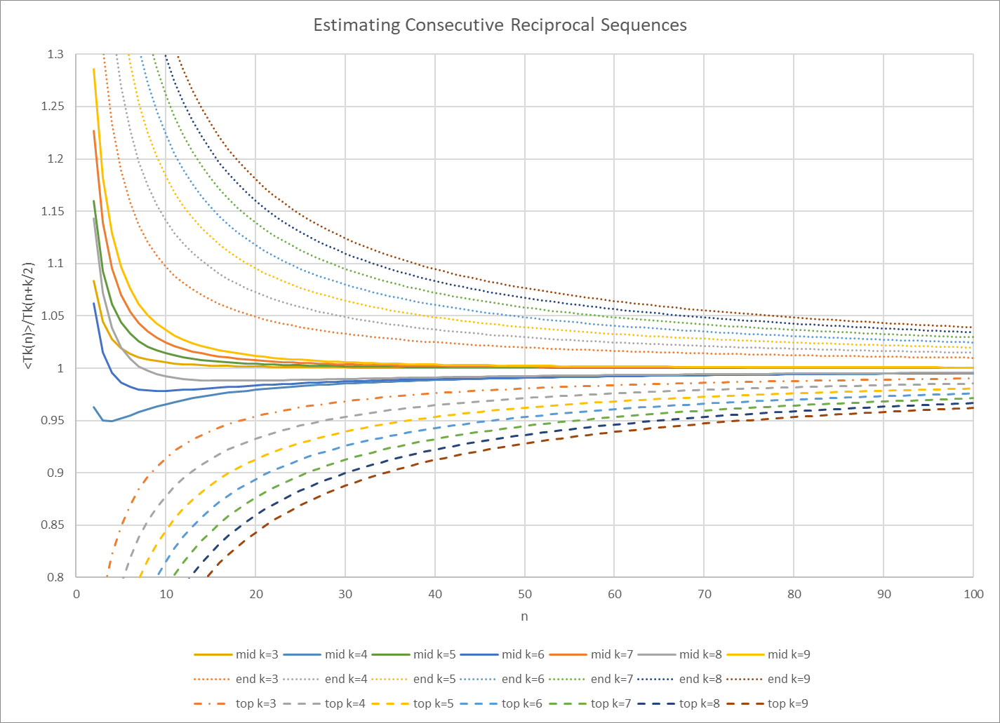
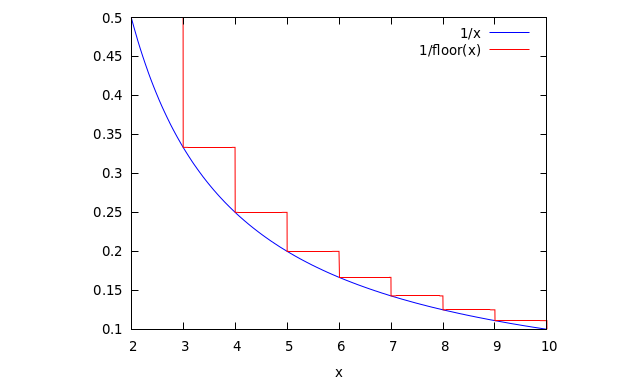
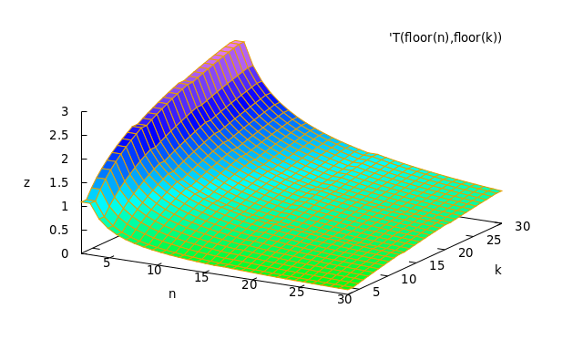
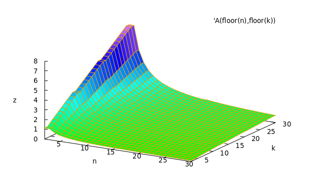
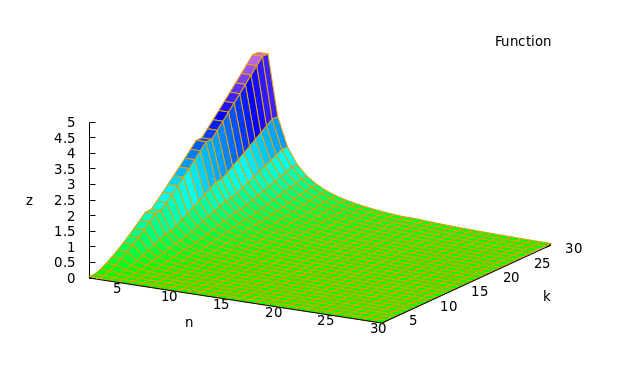
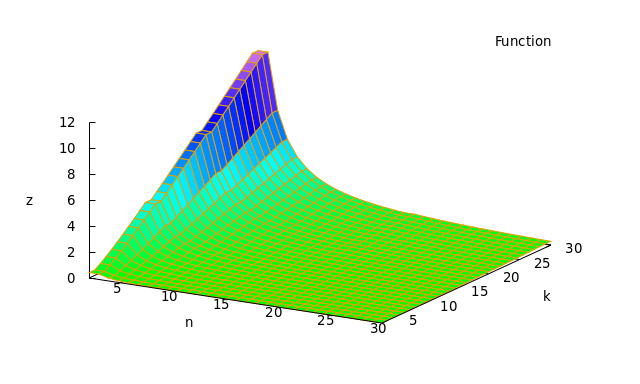
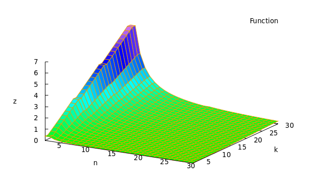

# Consecutive Sequences

Consider (in [sequence notation](seq.md)):

\\[\begin{split} \mathcal{T\_k(n)} =\mathcal{R} \lbrace n, n+1, n+2, \dots, n+k-1 \rbrace \\\\ = \frac{1}{n}+\frac{1}{n+1}+\frac{1}{n+2}+\dots+\frac{1}{n+k-1}  \\\\ \text{where} \quad k \gt 1\end{split} \\]

A consecutive sequence of *k* length starting at *n.*

## Maximum sequence

If \\(\mathcal{R\_k(n)}\\) is any squence of length *k* starting at *n* then
\\[ \mathcal{T\_k(n)} \ge \mathcal{R\_k(n)} \\]

since every element of \\(\mathcal{T\_k(n)}\\) is less or equal to the same element of \\(\mathcal{R\_k(n)}\\)

---

Also,

\\[\mathcal{T\_k(n)} \gt \mathcal{T\_{k}(n+1)} \ge \mathcal{R\_{k}(n+1)}\\]

## Limits

### length

\\[ \lim\_{k \to \infty }\mathcal{T\_k(n)}=\infty \quad \text{for all} \\, n\\]

\\[ \lim\_{k \to \infty }\mathcal{R\_k(n)} \ne\infty \quad \text{for some sequences}\\]
e.g. \\[\mathcal{R\_k(\lbrace 2\^{-i}\rbrace)}\lt 1\quad \text{for all}\\,k\\]

### Starting value

\\[ \lim\_{n \to \infty }\mathcal{T\_k(n)}=0 \quad \text{for all} \\, k\\]
\\[ \lim\_{n \to \infty }\mathcal{R\_k(\lbrace v\_i\rbrace})=0 \quad \text{for all} \\, k\quad \text{where}\quad v\_1=n\\]

## Estmate

### Simple boundary estimation 

Since
\\[\frac{1}{n}+\frac{1}{n}+\dots \gt \frac{1}{n}+\frac{1}{n+1}+\dots\\]

We have a upper bound estimate:

\\[ \frac{k}{n} \ge \mathcal{T\_k(n)} \quad \text{with equality only for} \\quad k=1\\] 

----
More accurate estimate:

Upper and lower bounds for estimate:

\\[\frac{k}{n} \gt \mathcal{T\_k(n)} \approx \frac{k}{n+k/2} \gt \frac{k}{n+k-1}\\]

### Linear Estimation

Plot reciprocals descrete and continuous.

\\[\frac{\mathrm{d}}{\mathrm{d}x}\frac{1}{x}=-\frac{1}{x\^2}\lt0 \quad \text{so decreasing}\\]
\\[\frac{\mathrm{d}\^2}{{\mathrm{d}x}\^2}\frac{1}{x}=\frac{2}{x\^3}\gt 0 \quad \text{so concave}\\]

Average of first and last:

\\[\mathcal{A\_k(n)}=\frac{k}{2}\times (\frac{1}{n}+\frac{1}{n+k-1})\approx \mathcal{T\_k(n)}\\]

----
\\[\mathcal{T\_k(n)}\quad\text{consecutive sum}\\]

----
\\[\mathcal{A\_k(n)}\quad\text{scaled average of first and last term}\\]

----
\\[\mathcal{A\_k(n)}-\mathcal{T\_k(n)}\quad\text{difference}\\]

Always positive

----
\\[\frac{\mathcal{A\_k(n)}-\mathcal{T\_k(n)}}{\mathcal{T\_k(n)}}\quad\text{proportional difference}\\]

Excellent for larger *n*

---
We can compare this with the rougher first term scaled:

\\[\frac{k}{n}-\mathcal{T\_k(n)}\quad\text{scaled first term}\\]

---
Although this look similar to \\(\mathcal{A\_k(n)}\\), we can plot the difference:

\\[\frac{k}{n}-\mathcal{A\_k(n)}\quad\text{first term vs average}\\]

