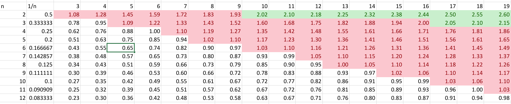
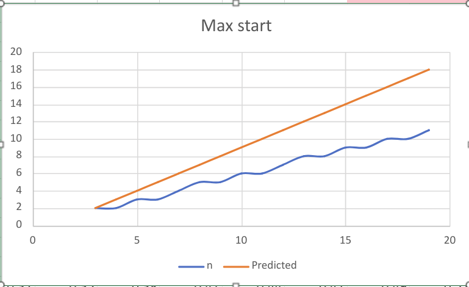

# Sequence starting point

We are examining all sequences of length *k*
\\[1=\mathcal{R\_k(\lbrace v\_i\rbrace)}\quad\text{for}\quad i=1 \rightarrow k\\]

and wish to know what are the bounds on \\(v\_1\\)

## Minimum

We claim that \\(\min{v\_1} = 2 \\)

### Lower

Is there a solution to

\\[\mathcal{R\_k(\lbrace v\_1,\dots \rbrace)} \ge 1\\]

Yes!

\\[ 1 \lt \mathcal{T\_3(2)}=\frac{1}{2}+\frac{1}{3}+\frac{1}{4}=\frac{13}{12} \lt 2\\]

### Upper

From our work on [consecutive sequences](consecutive.md)

\\[\lim\_{v\_4\to\infty}{\mathcal{R\_{k-3}(\lbrace v\_4, \dots\rbrace)}}=0\\]
so added terms can be chosen that still keep the sequence in the \\((1,2)\\) interval.
## Maximum

We require \\(\mathcal{R\_k(\lbrace v\_1,\dots \rbrace)} \ge 1\\)

From our work on [consecutive sequences](consecutive.md):
\\[ \frac{k}{n} \gt \mathcal{T\_k(n)}\ge\mathcal{R\_k(\lbrace n,\dots \rbrace)}\ge 1\\]

So 
\\[n \lt k\\]

## Bounds

So for length *k* need only search sequences whose first term *n*:
\\[2 \le n \lt k\\] 

## Numeric

A sample [spreadsheet](images/Starting.xlsa) gives:

From this the actual maximum starting term is significantly smaller than the predicted, because we chose a very conservative estimate for \\(\mathcal{T\_k(n)}\\).

